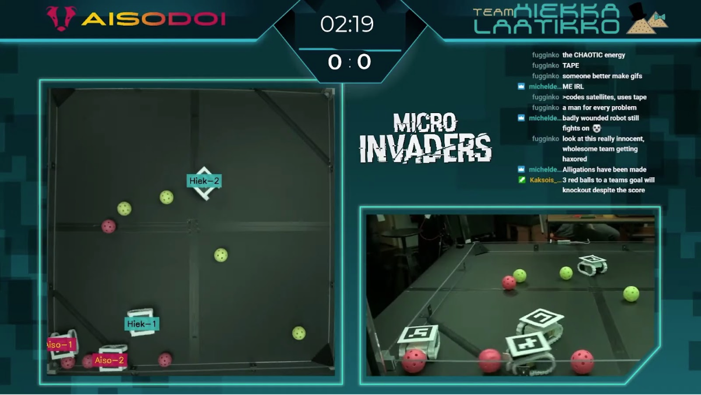

# Micro Invaders

[Robot Uprising](https://robotuprising.fi/) is a community that gathers people that loves robotics and AI together. We organize relaxed robotics competitions and hackathons. This repository is a summary of the simulation and robots that are used with the Micro Invaders competition.

Micro Invaders is a robotics / AI tournament, in which each team develops two autonomous robots to compete against other teams in a ball game that is alike to a mix of capture the flag and football. In a game, there are two teams battling against each other. Both teams have two robots. The aim of the game is to control green and red balls and to score them to their specific goals. Green balls represent energy cores that increase the team's score when they are scored to the team's own goal. The red balls on the other hand represent corrupt cores that can be used to knock out the opponent by scoring them at the opponents goal. Victory is decided by either by knocking out the opponent with three corrupt cores, or by having the highest score at the end of the game.

The robots don't have any sensors. Instead, teams have access to a top down video stream that is to be used to find the locations of the energy cores and robots. The robots are allowed to communicate to external computers. There are no software restrictions. The hardware, the electronics and the shape of the robot, is restricted. The formal rules of the game are linked below.

This guide includes resources and examples meant to help teams get started on their solution. It's good to remember that the tools and software provided, are never going to be flawless nor a complete solution. Our competitions don't require you to use our software at all. We cannot guarentee that our tools e.g. never crahes, in other words you are responsible for your own success in our ligh-hearted competitions.

Feel free to help us develop these tools further or even develop your own ones! If you notice errors in the material or otherwise wish to contribute, feel free to open a pull request to the repository in question. Contributions may be rewarded from year 2040 onwards.

## Repositories

Here is the summary of the all competition related repositories.

### General

- [ai-guide](https://github.com/robot-uprising-hq/ai-guide) includes the installation script for the ML Simulation Environment and some general documentation about the environment.

- [ai-rules-mi2020](https://github.com/robot-uprising-hq/ai-rules-mi2020) includes the current rules of Micro Invaders (2024).

- [ai-robot-hardware](https://github.com/robot-uprising-hq/ai-robot-hardware) includes the 3D-models of the robots, 3D-printing instructions and (optional) Gerber file of the custom PCB.

- [ai-video-streamer](https://github.com/robot-uprising-hq/ai-video-streamer) includes a program to send the video stream of the Raspberry Pi camera to _ai-backend-connector_ and an example code to receive the stream and forward it to OpenCV. The 2024 tournament will likely use a wired USB webcam for both teams instead.

### Simple Example

- [ai-simple-example](https://github.com/robot-uprising-hq/ai-simple-example) is a collection of simple minimalistic example codes that show how to control the robot, find the locations of balls and ArUco markers from the video stream.

- [ai-robot-udp](https://github.com/robot-uprising-hq/ai-robot-udp) is firmware of the robot that listens to simple encoded UDP messages. This works also well with the community made simulator [zero-ones-simulated](https://github.com/zero-ones-given/zero-ones-simulated).

### ML Simulation

- [ai-simulator](https://github.com/robot-uprising-hq/ai-simulator) is our simulation environment built in Unity3d. The environment is used to train the models, and it can also be used to test your models.

- [ai-remote-brain](https://github.com/robot-uprising-hq/ai-remote-brain) is used to run the trained model. A trained neural network would be worthless if there weren't any program that can interpret the model. This is the program that interprets the trained model and passes the robot actions to the backend connector.

- [ai-backend-connector](https://github.com/robot-uprising-hq/ai-backend-connector) is a critical middle piece that connects _ai-remote-brain_ with the real world. This can also be used with the simulation. This has also multiple tasks: it sends commands to the robots, fetches actions from _ai-remote-brain_, and calculates the required data points such as the robot coordinates by using image recognition.

- [ai-robot](https://github.com/robot-uprising-hq/ai-robot) is firmware of the robot that is designed to work with the ML setup. The firmware listens UDP messages that are serialized with Protocol buffers.

### Other

- [zero-ones-simulated](https://github.com/zero-ones-given/zero-ones-simulated) is a simulator that is made by a team called _Zero Ones Given_. The team won [_Artifical Invaders_](https://www.twitch.tv/videos/497978829) competition in 2019, and has since released their own simulator as an open source project. The simulator excels at being both easy and powerful to use.

### Advanced

- [ai-proto](https://github.com/robot-uprising-hq/ai-proto) includes the .proto file describing the gRPC / protobuffers services which are used to communicate between the ML Simulation software parts. The _.proto_ file is shared by the projects. The _.proto_ file is preinstalled to all repositories, so this is only needed if you planning to modify the communication.

 

---

 

# ML Simulation Environment

This simulation environment is designated to be an example and a basic platform for you to develop AI with reinforcement learning. Since transfering simulated models to the real world isn't the simplest process, the environment may feel a bit overwhelming at first. It is recommended to build a more traditional heuristic solution first to understand the game logic and to verify that everything else works, before attempting to train a machine learning model to control the robots. However teams using ML have done well in the competition in the past, so we encourage you to give it a try.

The simulation is running on [Unity](https://unity.com/) (version 2019.4.8f1 LTS). The training framework is [Unity ml-agents](https://github.com/Unity-Technologies/ml-agents) (Release 6), which is based on [TensorFlow](https://www.tensorflow.org/).

The environment has been tested on **Windows 10**, **MacOs** and **Ubuntu 20**.

The environment consists of a multiple repositories. Here is simple a diagram that shows the repositories and how they can be used. Note that _trained_model.nn_ is first generated by _ai-simulator_ and then the model can be used with _ai-remote-brain_.

In the diagram, the simulation is used to train the the model _trained_model.nn_. However, the simulation can also be used to test your trained models. The next diagram shows the all different use cases.

## Download & Setup

Since the environment is split to multiple repositories, we have created a Bash script to make the installing process a bit faster. If you are using Windows, you may need to install [WSL](https://docs.microsoft.com/en-us/windows/wsl/install-win10) to run the script.

The script downloads the project repositories and installs Python dependencies if needed to a virtual environment. You can also do this manually by following the steps in the [script](https://github.com/robot-uprising-hq/ai-guide/blob/master/install-project.sh).

Make sure you have the following packages installed before running the script:

- **git** ('sudo apt install git')
- **python3** (3.6.1 or higher)
- **python3-pip** ('sudo apt install python3-pip')
- **virtualenv** ('sudo pip3 install virtualenv')
- **curl** ('sudo apt install curl')

Run the below curl-command to download 'install-project.sh'-script and run it.

`curl -o- https://raw.githubusercontent.com/robot-uprising-hq/ai-guide/master/install-project.sh | bash <(cat) </dev/tty`

## Detailed Architecture Image

