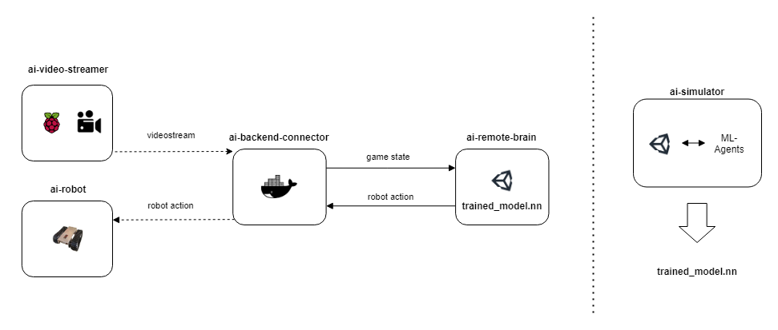
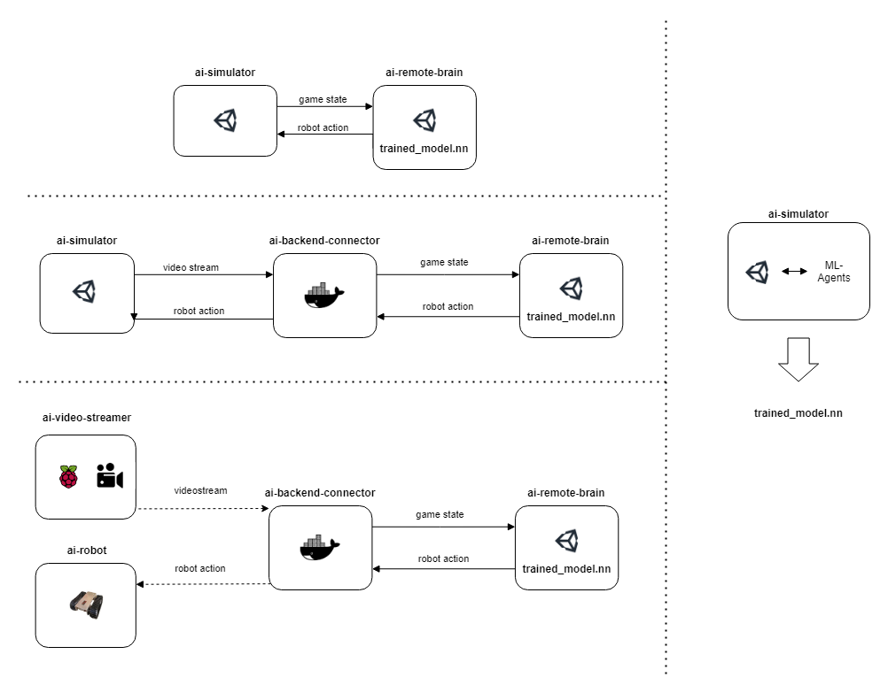
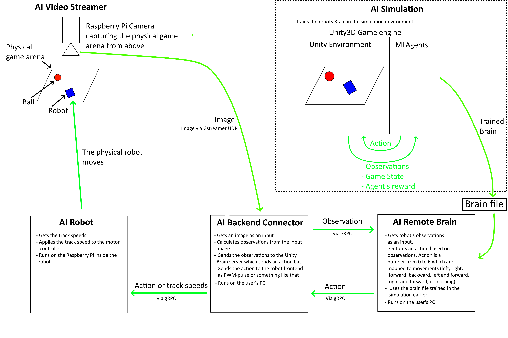

# Micro Invaders

**This is a still draft, the first official version is going to be release on the Week 41. So, we don't recomemend to start using the simulator yet, because it and its documentation are subject to changed and improved.**

[Robot Uprising](https://robotuprising.fi/) is a community that gathers people that loves robotics and AI together. We are organize relaxed robotics competitions and hackathons. This repository is a summary of the simulation and the robots that you can be use for the event Micro Invaders 2020. 

Micro Invaders is an robotics / AI tournament, in which each team develops two autonomous robots to compete against other teams in a capture the flag game. In a game, there are two teams battling against each other. Both teams have two robots. The aim of the game is to collect energy cores, i.e. balls, as fast as possible. The team with the highest score wins. 

The robots don't have any sensors. Instead, teams have access to a top down video stream that can be used to find the locations of the energy cores and robots. The robots are allowed to communicate to external computers. There are no software restrictions. The hardware, the electronics and the shape of the robot, is restricted. The more precise rules have been given for the participants.

It's good to remember that the tools and software, which we provide, are never going to be flawless. Our competitions don't require you to use our software at all. We cannot guarentee that our tools e.g. never crahes, in other words you are responsible for your own success in our ligh-hearted competitions. 

Feel free to help us develop these tools further or even develop your own ones!

## Repositories

Here is the summary of the all competition related repositories.

### General

- [ai-guide](https://github.com/robot-uprising-hq/ai-guide) includes the installation script for the ML Simulation Environment and some general documentation about the environment.

- [ai-rules-mi2020](https://github.com/robot-uprising-hq/ai-rules-mi2020) includes the rules of Micro Invaders 2020.

- [ai-robot-hardware](https://github.com/robot-uprising-hq/ai-robot-hardware) includes the 3D-models of the robots and 3D-printing instructions.

- [ai-video-streamer](https://github.com/robot-uprising-hq/ai-video-streamer) is used to send the video stream of the Raspberry Pi camera to *ai-backend-connector*. Rasberry Pi camera captures a top-down view of the game. During the competition, the organizers runs this exact code on Rasbbery Pi, so you are not able to modify this, except do pull requests.

### ML Simulation

- [ai-simulator](https://github.com/robot-uprising-hq/ai-simulator) is the simulation environment. The environment is used to train the models, and it can also be used to test your models.

- [ai-remote-brain](https://github.com/robot-uprising-hq/ai-remote-brain) is used to run the trained model. A trained neural network would be worthless if there weren't any porgram that can interpret the model. This is the program that interprets the trained model and sends the actions back.

- [ai-backend-connector](https://github.com/robot-uprising-hq/ai-backend-connector) is a critical middle piece that connects *ai-remote-brain* with the real world. This can also be used with the simulation. This has also multiplte tasks: it sends commands to robots, fetches actions from *ai-remote-brain*, and calculates the required data points such as robot coordinates by using image recognition.

- [ai-robot](https://github.com/robot-uprising-hq/ai-robot) is the firmware of the robot. The firmware listens UDP Protobuffer commands.

### Other

- [zero-ones-simulated](https://github.com/zero-ones-given/zero-ones-simulated) is a simulator that is made by a group called *Zero Ones Given*. The team won *Artifical Invaders* competition last year, and this year they released their own simulator as an open source project. The simulator excels at being at the same time easy and powerful to use.

### Advanced

- [ai-proto](https://github.com/robot-uprising-hq/ai-proto) includes the .proto file describing the gRPC / protobuffers services which are used to communicate between the ML Simulation software parts. The *.proto* file is shared by the projects. The *.proto* file is preinstalled to all repositories, so this is only needed if you planning to modify the communication.

 

---

 

# ML Simulation Environment

This simulation environment is designated to be an example and a basic platform for you to develop AI with reinforcement learning. Since transfering simulated models to the real world isn't the simplest process, the environment may feel a bit overwhelming at first.

The simulation is running on [Unity](https://unity.com/) (version 2019.4.8f1 LTS). The training framework is [Unity ml-agents](https://github.com/Unity-Technologies/ml-agents) (Release 6), which is based on [TensorFlow](https://www.tensorflow.org/). 

The environment has been tested on **Windows 10**, **MacOs** and **Ubuntu 20**.

The environment consists of a multiple repositories. Here is simple a diagram that shows the repositories and how they can be used. Note that *trained_model.nn* is first generated by *ai-simulator* and then the model can be used with *ai-remote-brain*.

In the diagram, the simulation is used to train the the model *trained_model.nn*. However, the simulation can be used also to test your trained models. The next diagram shows the all different use cases.

## Download & Setup

Since the environment is splitted to multiple repositories, we have created a Bash script to make the installing process a bit faster. If you are using Windows, you may need to install [WSL](https://docs.microsoft.com/en-us/windows/wsl/install-win10) to run the script.

The script downloads the project repositories and installs Python dependencies if needed to a virtual environment.

Make sure you have the following packages installed before running the script:

- **git**         ('sudo apt install git')
- **python3**     (3.6.1 or higher)
- **python3-pip** ('sudo apt install python3-pip')
- **virtualenv**  ('sudo pip3 install virtualenv')
- **curl**	      ('sudo apt install curl')

Run the below curl-command to download 'install-project.sh'-script and run it.

`curl -o- https://raw.githubusercontent.com/robot-uprising-hq/ai-guide/master/install-project.sh | bash  <(cat) </dev/tty`

--- 

## Detailed Architecture Image

